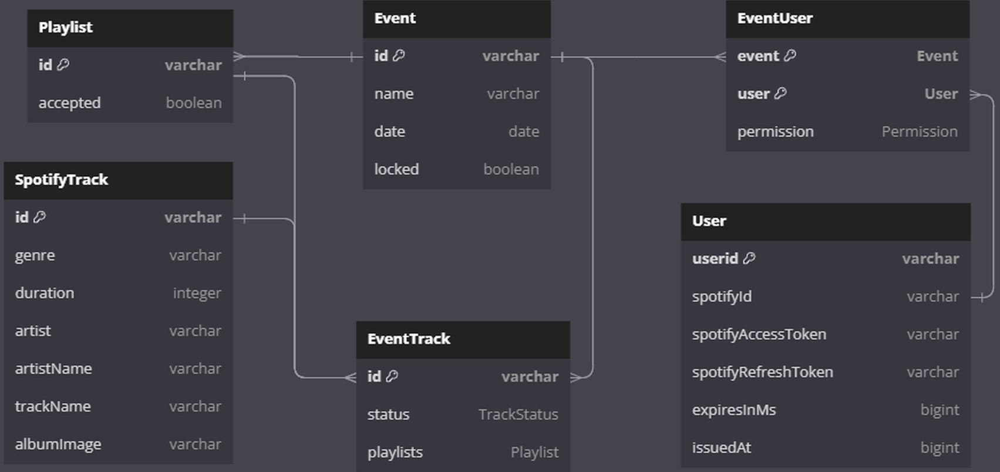
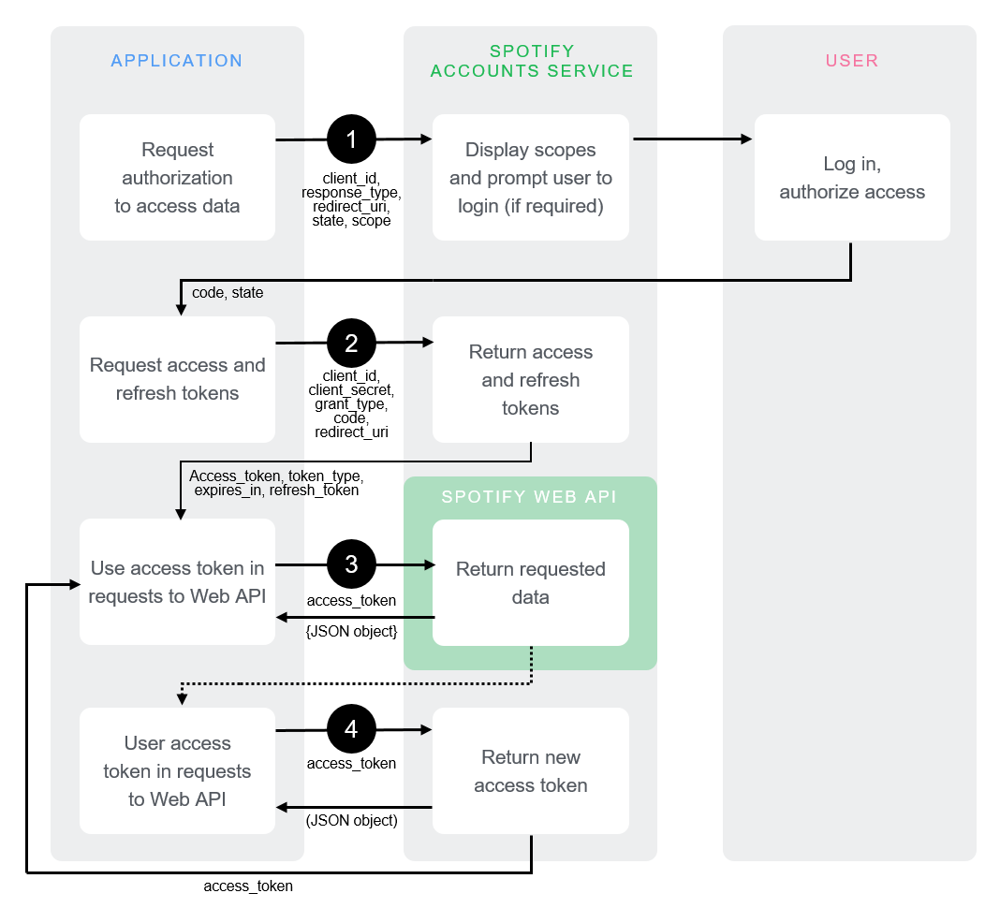

# Spotify Project
- - -
Create an event with the perfect playlist everyone loves.

<br>

## Disclaimer - Anfängliche Organisation
- - -
Wir haben eine klare Aufgabenteilung zwischen Backend und Frontend gemacht. Björn, Noah und Antoine haben sich
hier anfangs um das Backend gekümmert, während Paul und Sebi hauptsächlich am Frontend gearbeitet haben. 
Im Verlaufe des Projektes gab es neben Absprachen in beide Richtungen auch Arbeiten an der Gegenseite während 
gegenseitigem Zuschneiden von Funktionalitäten.

### Team Frontend

##### Sebi & Paul:
- anfänglich zusammen mit Team Backend gemeinsames Überlegen von Anforderungen und Routenstruktur
- gemeinsames Entwerfen von Mockups und Funktionsanforderungen einzelner Seiten und Komponenten
- gemeinsames Arbeiten über Code-With-Me & Discord der gesamten Frontend Dateistruktur & Inhalte
- anfangs diverses Troubleshooting mit allen Projektbeteiligten bezüglich SPOTIFY-API Dreiecks CORS Beziehung Frontend->Backend->API
- diverse Änderungen & Verbesserungen des Backends bei laufender Frontendentwicklung (auftretende Fehler beheben, speziell in Track und Algorithmus handling der Playlist - Generation) 

### Team Backend:

##### Noah & Björn:
- regelmäig Freitags & Samstags online getroffen
   - Zusammenarbeit in Jetbrains Webstorm code with me 
     - erhöhte Produktivität durch pair programming
     - weniger Git Konflikte
     - Möglichst einheitliche Formatierung und Kommentierung des Codes
- entity-relationship Konzept und Implementierung
- event.controller-struktur Konzept und Implementierung
   - auth.spotify.controller.ts
   - event.algorithm.controller.ts
   - event.controller.ts 
   - event.settings.controller.ts 
- Integration des participants-controllers
- auth.middleware.ts
- Spotify-Anbindung & Authentication auf Basis von Sebi's Prototyp
- Debugging mit Team Frontend (schnelles Troubleshooting bei Integration des Frontend)
- Hilfe bei Integration im Frontend
- backend readme
  - Während der Implementierung der Routen in den controllern haben wir immer die... 

##### Antoine:
- Unterstützung von Backend und Frontend über Code with Me
- Unterstützung bei CORS Problemen zwischen Backend und Frontend
- Gitlab-CI Pipeline
- Docker Umgebung inklusive Dockerfile und docker-compose
- event.controller-struktur konzept und implementierung
   - event.participants.controller.ts
   - event.controller.ts
- Datenbank automatische Erstellung von Tabellen in der Docker Umgebung
- Entwicklung einer Test Strategie fürs Backend (In der Abschlusspräsentation)
- Backend readme   

Disclaimer Antoine
In den letzten Wochen vor der Abgabe ist bei mir ein nahestehender verstorben, weswegen ich zum Schluss nicht in gewohnter intensität am Projekt teilnehmen konnte. 

<br>

## Backend
- - -
### Start (Docker)
Um das Backend zu verwenden reicht es, aus dem Projekt-root folgenden Befehl auszuführen
```shell
docker compose up --build
```

### Anforderungen
- Node.js & NPM
- Docker & Docker Compose

### Unser Setup
- Ubuntu 22.04
- Node.js v18.14.1
- Package Manager 9.3.1
- Docker version 20.10.17
- Docker-compose version 1.29.2

- - -

### Entitiy Structure

Dies ist lediglich eine Visualisierung und enthält nicht alle Attribute wie not null oder spezifische Datentypen.

### (Spotify-) Authorization
Wir haben kein eigenes Login System implementiert, sondern nutzen den durch Spotify generierten access- & refresh token.


Als Anbindung an die Spotify API verwenden wir den 
[Authorization Code Flow](https://developer.spotify.com/documentation/web-api/tutorials/code-flow) OAuth2 flow.
Wir lagern somit sämtliche Authentification an Spotify aus und verwenden ihren access_token zum Validieren des Nutzers.

### Backend Routen
Für fast alle Routen ist das Setzen des "Authorization" Headers mit einem gültigen spotify access_token nötig. 

Dieses ist vonseiten Spotifys für maximal eine Stunde gültig, wobei ein weiteres während oder nach dessen Ablauf per 
Refresh Token unter /account/refresh_token angefordert und gespeichert werden kann.

### Auth Middleware
| method                  | codes    | description                                        |
|-------------------------|----------|----------------------------------------------------|
| verifySpotifyAccess     | 401      | checks authorization header field for valid token  |       
| verifyEventAccess       | 401, 403 | checks user is part of the event                   |
| verifyParticipantAccess | 401, 403 | checks user is at least a participant in the event |
| verifyAdminAccess       | 401, 403 | checks user is at least a admin in the event       |
| verifyOwnerAccess       | 401, 403 | checks user is the owner of the event              |

### Spotify Authentication ( /account )
| method | route                  | codes    | Middleware          | description                                     |
|--------|------------------------|----------|---------------------|-------------------------------------------------|
| GET    | /login                 | -        | -                   | redirects the user to the spotify login         |       
| GET    | /login_response        | tbd      | -                   | callback from spotify, redirects user           |
| PUT    | /refresh_token         | 200, 400 | verifySpotifyAccess | trades the refresh_token for a new access_token |
| GET    | /spotifyUserId         | 200      | verifySpotifyAccess | returns the spotify user id of this token       |
| GET    | /remaining_expiry_time | 200      | verifySpotifyAccess | returns in ms how long the token is still valid |
| PUT    | /logout                | 204      | verifySpotifyAccess | resets the spotify access_token                 |


### Event ( /events )
| method | route     | codes    | Middleware          | description                                        |
|--------|-----------|----------|---------------------|----------------------------------------------------|
| GET    | /         | todo     | verifySpotifyAccess | returns all events of this user                    |
| POST   | /         | 200, 500 | verifySpotifyAccess | create new event with the user as owner            |
| GET    | /:eventId | 200, 404 | verifyEventAccess   | returns one event and adds the user as participant |
| PUT    | /:eventId | 200, 400 | verifyEventAccess   | removes the user (except owner) from the event     |
| DELETE | /:eventId | 200, 400 | verifyOwnerAccess   | the owner can delete this event                    |

### Event Participants ( /events/:eventId/participants )
| method | route                        | codes              | Middleware        | description                   |
|--------|------------------------------|--------------------|-------------------|-------------------------------|
| GET    | /                            | 200, 400           | verifyAdminAccess | fetch detailed users of event |
| PUT    | /:spotifyUserId              | 204, 400, 403, 404 | verifyAdminAccess | kicks user from event         |
| PUT    | /:spotifyUserId/:permissions | 204, 400, 403, 404 | verifyAdminAccess | change user permissions       |

### Event Playlist ( /events/:eventId/tracks )
| method | route                      | codes         | Middleware              | description                         |
|--------|----------------------------|---------------|-------------------------|-------------------------------------|
| GET*   | /                          | 200           | verifyEventAccess       | return all event tracks             |
| GET    | /search                    | 200           | verifyEventAccess       | returns spotify tracks per search   |
| GET    | /spotifyPlaylistIds        | 200           | verifyEventAccess       | return ids of all playlists         |
| GET    | /:spotifyPlaylistId        | 200, 404      | verifyEventAccess       | returns list of all playlist tracks |
| POST   | /:spotifyTrackId           | 201, 429      | verifyParticipantAccess | propose new event track to playlist |
| DELETE | /:spotifyTrackId           | 200           | verifyParticipantAccess | delete event track out of playlist  |
| POST   | /save/:spotifyPlaylistId   | 200           | verifyParticipantAccess | export playlist & tracks to spotify |
| PUT*   | /:spotifyTrackId/:status   | 200, 400, 404 | verifyAdminAccess       | change event track status           |
| POST*  | /:spotifyPlaylistId        | 201, 429      | verifyParticipantAccess | propose new playlist                |
| PUT*   | /:spotifyPlaylistId/accept | 200, 404      | verifyAdminAccess       | accept all songs from a playlist    |
| PUT*   | /:spotifyPlaylistId/remove | 404           | verifyAdminAccess       | remove all songs from a playlist    |
*currently unused
Note: The status code 429 is returned by spotify if the app has exceeded its rate limits.

### Event Settings ( /events/:eventId/settings )
| method | route          | codes   | Middleware        | description                 |
|--------|----------------|---------|-------------------|-----------------------------|
| PUT    | /generateNewId | 200,500 | verifyOwnerAccess | generates new ID for Event  | 
| PUT    | /id/:newID     | 200,400 | verifyOwnerAccess | set custom ID for Event     |
| PUT    | /name/:newName | 200     | verifyOwnerAccess | set new Name for Event      |
| PUT    | /date/:newDate | 200     | verifyOwnerAccess | set new date for event      |
| PUT*   | /lock          | 200     | verifyOwnerAccess | close Event for new Entries |
| PUT*   | /unlock        | 200     | verifyOwnerAccess | open Event for new Entries  |
*currently unused

### Event Algorithm ( /events/:eventId/algorithm )
| method | route     | codes              | Middleware             | description                                |
|--------|-----------|--------------------|------------------------|--------------------------------------------|
| PUT    | /generate | 500, 200, 400, 404 | verifyEventOwnerAccess | Generates songs based on all participants. |

### Tests
Das Backend und Frontend lässt sich leider nicht leicht per Postman oder automatisierten Tests testen, da alles sehr stark an die Spotify-API angebunden ist und somit auch abhängig von dieser ist. Dies hängt mit der Funktionsweise unserer Anwendung zusammen und hat seine Richtigkeit. Man könnte in Postman zwar per persistierten Dummy Usern und pre-request-script gültige API-Keys Simulieren, allerdings ist dieser Aufwand für uns nicht als sinnvoll erachtet, da die Erreichbarkeit der Routen zwar getestet werden könnte, nicht aber deren Rückgabewerte. Getestet wird also über die live Anwendung. Daher haben wir frühzeitig Kontakt mit unserem Projektbetreuer aufgenommen, nach Rücksprache mit ihm sollen wir in unserer README erwähnen, wie man das Testing mit deutlich mehr Zeit durchführen könnte. Normalerweise, wenn man mehr Zeit für das Projekt hätte, dann würde man die Anwendung und somit auch die Tests unabhängiger von der Spotify-API machen. Die Spotify-API würde von uns Gemockt also im kleinen Nachgebaut werden, sodass diese unsere Automatisierten / Postman Tests nicht mehr behindert. Backend und Frontend sollten möglichst komplett unabhängig voneinander und von anderen getrennt testbar sein.

### CI/CD
Eine CI/CD Pipeline ist eingerichtet, diese testet nach jedem Commit und Merge den Code durch. 

<br>

## Frontend
- - -

### Start (Docker)
Um das Frontend zu verwenden, muss
1. Das Backend gestartet und über Port 4000 erreichbar sein.
2. Folgende Befehle ausgeführt werden
```shell
cd .\frontend\
```
```shell
npm i
```
```shell
npm run dev 
```
- - -
### Anforderungen
- Node.js & NPM

### Unser Setup
- Node.js v18.14.1
- Package Manager 9.3.1
- Vite 4.3.2
- Installierte Node Packages nach packages.json

### Frontend Test
Um den zu erwartenden Flow in der Verwendung der Applikation für den Nutzer greifbar und testbar zu gestalten, haben wir im root des Projektes eine Aufnahme dessen Workflows in der Datei "frontend.mp4" hinzugefügt.