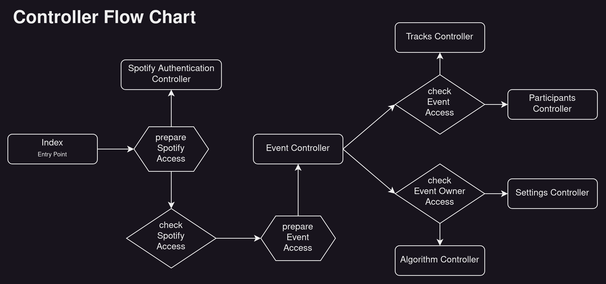

# Spotify Project
- - -
Create an event with the perfect playlist everyone loves.
<br>

## Backend
- - -
### Start (Docker)
Um das Backend zu verwenden reicht es, Docker am Laufen zu haben und aus dem Projekt-root folgenden Befehl auszuführen
```shell
docker compose up --build
```

### Anforderungen
- Node.js & NPM
- Docker & Docker Compose

### Setup
- Ubuntu 22.04
- Node.js v18.14.1
- Package Manager 9.3.1
- Docker version 20.10.17
- Docker-compose version 1.29.2

- - -

### Entitiy Structure


### Controller Structure


### (Spotify-) Authorization
Als Anbindung an die Spotify API verwenden wir den 
[Authorization Code Flow](https://developer.spotify.com/documentation/web-api/tutorials/code-flow) OAuth2 flow.
Wir lagern somit sämtliche Authentification an Spotify aus und verwenden ihren access_token zum Validieren des Nutzers.


### Backend Routen
Für fast alle Routen ist das Setzen des "Authorization" Headers mit einem gültigen spotify access_token nötig. 

Dieses ist vonseiten Spotifys für maximal eine Stunde gültig, wobei ein weiteres während oder nach dessen Ablauf per 
Refresh Token unter /account/refresh_token angefordert und gespeichert werden kann.

### Auth Middleware
| method                            | codes    | description                                        |
|-----------------------------------|----------|----------------------------------------------------|
| verifySpotifyAccess               | 401      | checks authorization header field for valid token  |       
| verifyEventAccess                 | 403      | checks user is part of the event                   |
| verifyEventAndParticipantAccess   | 403      | checks user is at least a participant in the event |
| verifyEventAndAdminAccess         | 403      | checks user is at least a admin in the event       |
| verifyEventAndOwnerAccess         | 403      | checks user is the owner of the event              |
| verifyUnlockedEvent               | 403      | checks if the event is unlocked                    |


### Spotify Authentication ( /account )
| method | route                  | codes    | Middleware          | description                                      |
|--------|------------------------|----------|---------------------|--------------------------------------------------|
| GET    | /login                 | -        | -                   | redirects the user to the spotify login          |       
| GET    | /login_response        | -        | -                   | callback from spotify, redirects user to frontend|
| PUT    | /refresh_token         | 200, -   | verifySpotifyAccess | trades the refresh_token for a new access_token  |
| GET    | /spotifyUserId         | 200      | verifySpotifyAccess | returns the spotify user id of this token        |
| GET    | /remaining_expiry_time | 200      | verifySpotifyAccess | returns in ms how long the token is still valid  |
| PUT    | /logout                | 204      | verifySpotifyAccess | resets the spotify access_token                  |
Note: Spotify can return various error codes on wrong logins etc. which are returned by catches

### Event ( /events )
| method | route     | codes         | Middleware               | description                                           |
|--------|-----------|---------------|--------------------------|-------------------------------------------------------|
| GET    | /         | 200           | verifySpotifyAccess      | returns all events of this user                       |
| POST   | /         | 201, 500      | verifySpotifyAccess      | create new event with the user as owner               |
| GET    | /:eventId | 200, 404, 500 | verifySpotifyAccess      | returns one event (~and adds the user as participant) |
| PUT*   | /:eventId | 200, 400      | verifyEventAccess        | removes the user (except owner) from the event        |
| DELETE | /:eventId | 200, 404      | verifyEventAndOwnerAccess| the owner can delete this event                       |

### Event Participants ( /events/:eventId/participants )
| method | route                        | codes              | Middleware                | description                   |
|--------|------------------------------|--------------------|---------------------------|-------------------------------|
| GET    | /                            | 200, 400           | verifyEventAccess         | fetch detailed users of event |
| PUT    | /:spotifyUserId              | 204, 400, 403, 404 | verifyEventAndAdminAccess | kicks user from event         |
| PUT    | /:spotifyUserId/:permissions | 204, 400, 403, 404 | verifyEventAndAdminAccess | change user permissions       |

### Event Playlist ( /events/:eventId/tracks )
| method | route                      | codes         | Middleware               | description                         |
|--------|----------------------------|---------------|--------------------------|-------------------------------------|
| GET    | /search                    | 200           | verifyEventAccess        | returns spotify tracks per search   |
| GET    | /spotifyPlaylistIds        | 200           | verifyEventAccess        | return ids of all playlists         |
| GET    | /:spotifyPlaylistId        | 200, 404      | verifyEventAccess        | returns list of all playlist tracks |
| POST   | /:spotifyTrackId           | 201, 404, 429 | verifyParticipantAccess  | propose new event track to playlist |
| DELETE | /:spotifyTrackId           | 200           | verifyParticipantAccess  | delete event track out of playlist  |
| POST   | /save/:spotifyPlaylistId   | 200           | verifyEventAndOwnerAccess| export playlist & tracks to spotify |
| PUT*   | /:spotifyTrackId/:status   | 200, 400, 404 | verifyAdminAccess        | change event track status           |
| POST*  | /:spotifyPlaylistId        | 201, 429      | verifyParticipantAccess  | propose new playlist                |
| PUT*   | /:spotifyPlaylistId/accept | 200, 404      | verifyAdminAccess        | accept all songs from a playlist    |
| PUT*   | /:spotifyPlaylistId/remove | 404           | verifyAdminAccess        | remove all songs from a playlist    |
*currently unused
Note: The status code 429 is returned by spotify if the app has exceeded its rate limits.

### Event Settings ( /events/:eventId/settings )
| method | route          | codes   | Middleware        | description                 |
|--------|----------------|---------|-------------------|-----------------------------|
| PUT    | /id/:newID     | 200,400 | verifyOwnerAccess | set custom ID for Event     |
| PUT    | /name/:newName | 200     | verifyOwnerAccess | set new Name for Event      |
| PUT    | /date/:newDate | 200     | verifyOwnerAccess | set new date for event      |
| PUT*   | /lock          | 200     | verifyOwnerAccess | close Event for new Entries |
| PUT*   | /unlock        | 200     | verifyOwnerAccess | open Event for new Entries  |

*currently unused

### Event Algorithm ( /events/:eventId/algorithm )
| method | route     | codes              | Middleware             | description                                |
|--------|-----------|--------------------|------------------------|--------------------------------------------|
| PUT    | /generate | 500, 200, 400, 404 | verifyEventOwnerAccess | Generates songs based on all participants. |

<br>

## Frontend
- - -

### Start (Docker)
Um das Frontend zu verwenden, muss
1. Das Backend gestartet und über Port 4000 erreichbar sein.
2. Folgende Befehle ausgeführt werden
```shell
cd .\frontend\
```
```shell
npm i
```
```shell
npm run dev 
```
- - -
### Anforderungen
- Node.js & NPM

### Unser Setup
- Node.js v18.14.1
- Package Manager 9.3.1
- Vite 4.3.2
- Installierte Node Packages nach packages.json

### Frontend Test
Um den zu erwartenden Flow in der Verwendung der Applikation für den Nutzer greifbar und testbar zu gestalten, haben wir im root des Projektes eine Aufnahme dessen Workflows in der Datei "frontend.mp4" hinzugefügt.